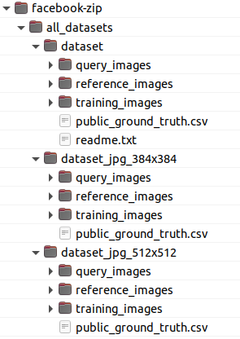
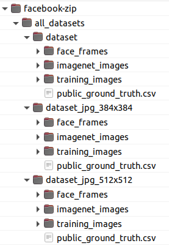

# Downloading Datasets:

This folder is the place where the original datasets should be located:


## Facebook's competiton

- Images folders: <br />
```
all_datasets/dataset/query_images
all_datasets/dataset/reference_images
all_datasets/dataset/training_images
```

- PublicGroundTruth location:
```
all_datasets/dataset/public_ground_truth.csv
```


## Imagent dataset

- Images folder:
```
all_datasets/dataset/imagenet_images
```
- Dataset downloaded from: 
https://www.kaggle.com/c/imagenet-object-localization-challenge/data


The images were renamed using:  <br />
```
modules/ImageNet_renamer.py
```

## DeepFake competition

This dataset was not used for the training of the models used in the final solution of the competition.

- Images folder: <br />
```
all_datasets/dataset/face_frames
```

- Dataset downloaded from: <br />
https://www.kaggle.com/c/deepfake-detection-challenge

- 3 frames were extracted from each video using: <br />
```
modules/DeepFake_frames_extractor.py
```


## Datasets structure

- Next image shows the inference datasets structure:
```
all_datasets/inference_datasets_structure.png
```


- Next image shows the training datasets structure:
```
all_datasets/training_datasets_structure.png
```



